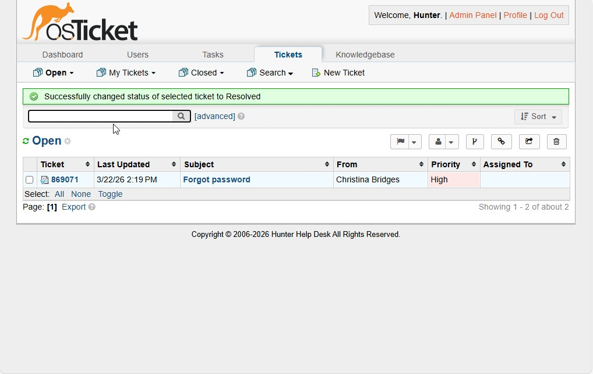
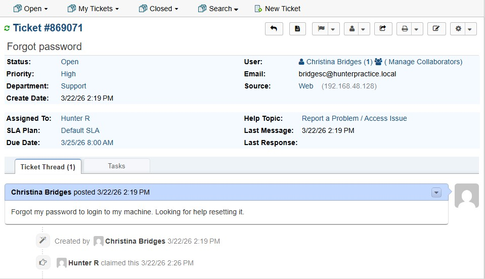
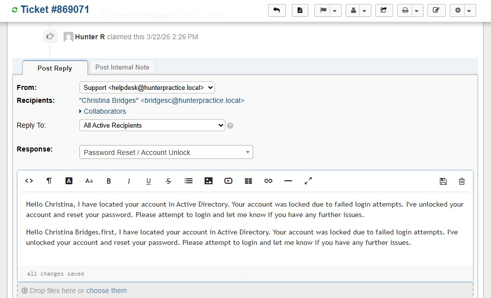
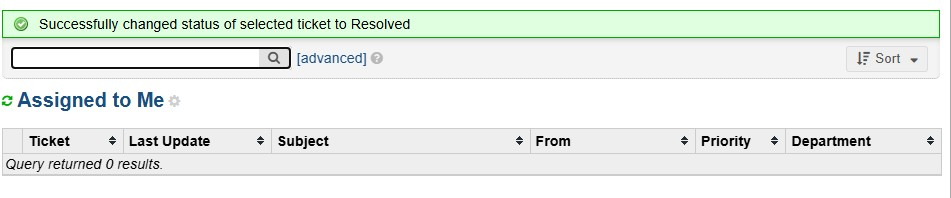
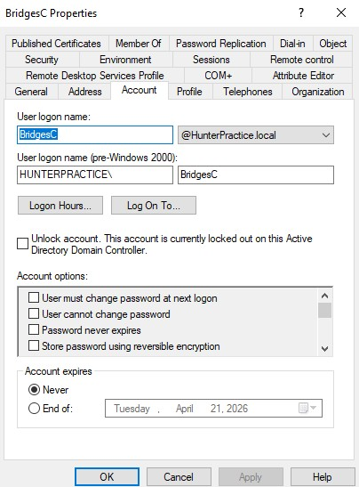
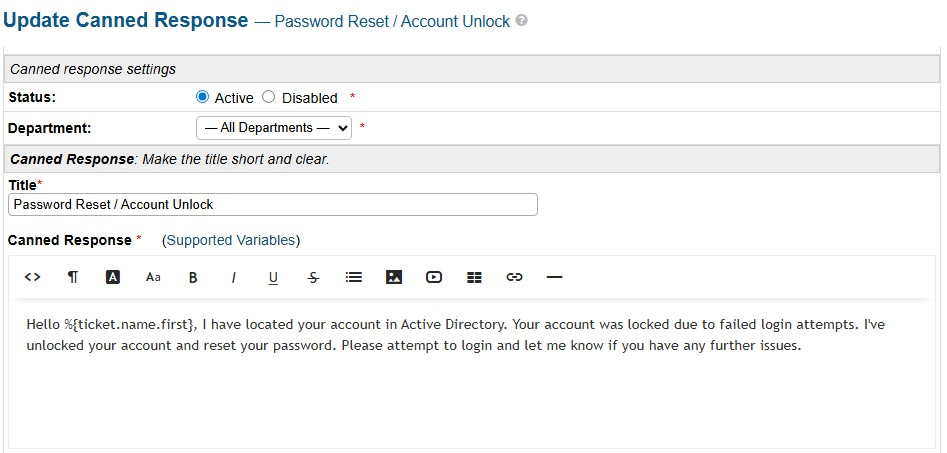

# Scenario 01 — Account Lockout / Password Reset
 
## Overview
An employee is unable to log into their workstation after their account was locked due to 3 failed login attempts. This is a very common ticket request.
 
---
 
## Environment
- **Ticketing System:** osTicket (self-hosted on OSTICKETMACHINE)
- **Domain:** hunterpractice.local
- **Domain Controller:** WIN-AJ3IQ5KJNUB (Windows Server 2022)
- **Client Machine:** COMP1 (domain-joined Windows VM)
- **Affected User:** C. Bridges (BridgesC)
 
---
 
## Problem
User attempted to log into COMP1 3 times with the wrong password, triggering the domain account lockout policy. The user received an error stating their account was locked and they were unable to access their workstation.
 
**GPO Lockout Policy applied:**
- Lockout threshold: 3 invalid attempts
- Lockout duration: 0 (manual admin unlock required)
- Reset lockout counter after: 15 minutes
 
---
 
## Ticket Workflow
 
| Status | Action |
|---|---|
| **New** | User submitted ticket via osTicket client portal |
| **Open** | Technician assigned ticket and began investigation |
| **Resolved** | User confirmed successful login, ticket closed |
 
---
 
## Troubleshooting Steps
 
### Step 1 — Receive and Triage Ticket
- Ticket received via osTicket client portal
- Assigned ticket to Hunter R in SCP
- Reviewed user details and identified affected account (BridgesC)
 
### Step 2 — Locate Account in Active Directory
- Opened **Active Directory Users and Computers** on WIN-AJ3IQ5KJNUB
- Located BridgesC under `hunterpractice.local → USA → Reno`
- Confirmed account was locked — **"Unlock account"** checkbox was ticked on the Account tab
 
### Step 3 — Unlock Account and Reset Password
- Checked the **"Unlock account"** checkbox to unlock
- Right clicked account → **Reset Password**
- Set temporary password
- Ensured **"User must change password at next logon"** was checked
 
### Step 4 — Document and Close Ticket
- Replied to ticket informing user account was unlocked and temporary password was set
- User confirmed successful login via client portal
- Set ticket status to **Resolved**
 
---
 
## Resolution
Account was located in Active Directory, confirmed as locked due to failed login attempts. Account was unlocked and password was reset. User was prompted to set a new password on next login. User confirmed successful access.
 
---
 
## Screenshots
 
| File | Description |
|---|---|
|  | User seeing lockout error |
|  | Ticket visible in SCP queue |
|  | Ticket assigned to Hunter R |
|  | Response to user |
|  | Closed ticket |
|  | Unlocked the user account in Active Directory |
|  | Creating a standard response to similar problems |
 
---
 
## Key Concepts Demonstrated
- Active Directory account management
- GPO account lockout policy configuration
- Help desk ticket lifecycle (New → Open → Resolved)
- Clear and professional ticket documentation
