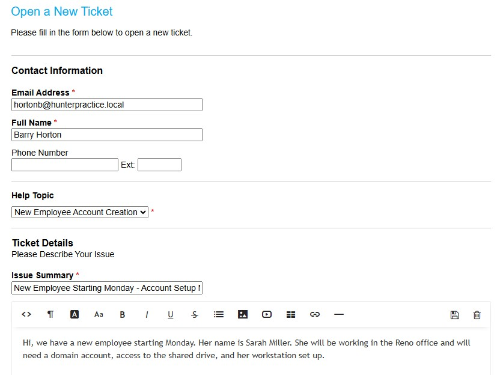
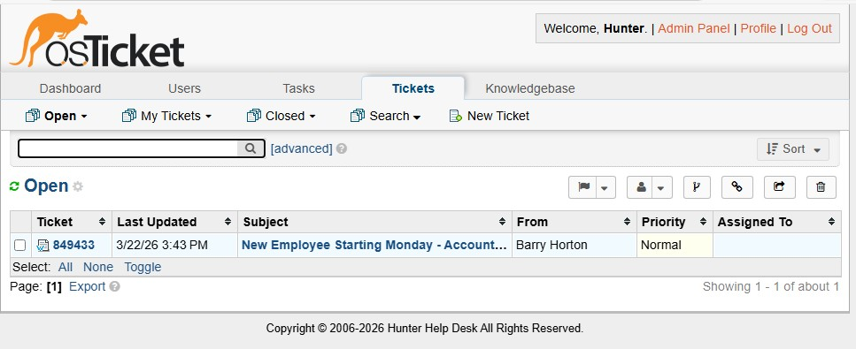
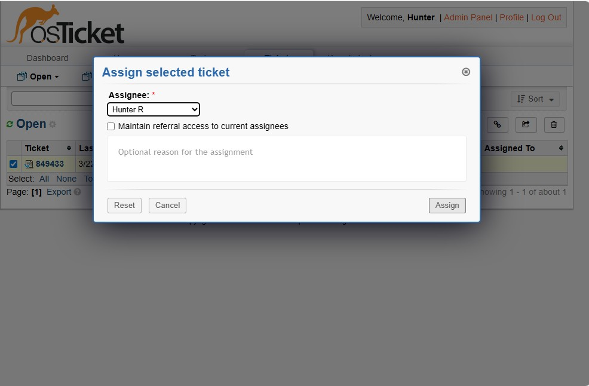
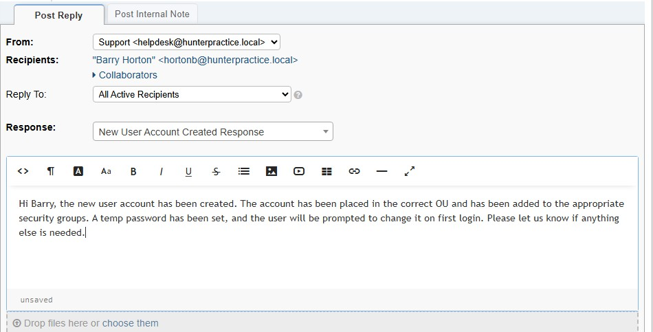
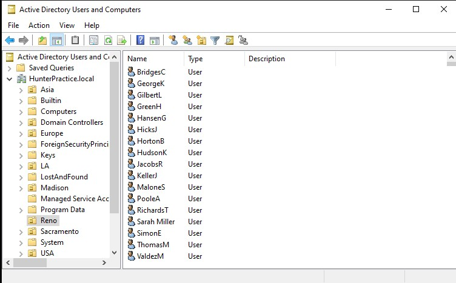
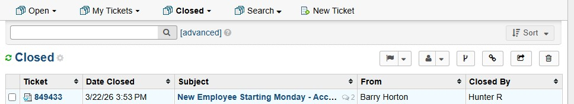

# Scenario 02 — New Employee Onboarding
 
## Overview
A manager submits a ticket requesting a new employee account be created before their start date. This scenario covers the full onboarding workflow including AD account creation, OU placement, group membership, and manager communication.
 
---
 
## Environment
- **Ticketing System:** osTicket (self-hosted on OSTICKETMACHINE)
- **Domain:** hunterpractice.local
- **Domain Controller:** WIN-AJ3IQ5KJNUB (Windows Server 2022)
- **New User:** Sarah Miller (smiller)
- **Requesting Manager:** Existing AD user
 
---
 
## Problem
A new employee, Sarah Miller, is starting Monday and requires a domain account to be created with the correct OU placement, group memberships, and temporary password before her first day.
 
---
 
## Ticket Workflow
 
| Status | Action |
|---|---|
| **New** | Manager submitted ticket via osTicket client portal |
| **Open** | Technician assigned ticket and began account creation |
| **Resolved** | Manager confirmed account is ready, ticket closed |
 
---
 
## Troubleshooting Steps
 
### Step 1 — Receive and Triage Ticket
- Ticket received from manager via osTicket client portal
- Reviewed request details: new employee name, department, start date
- Assigned ticket to Hunter R in SCP
 
### Step 2 — Create AD Account
- Opened **Active Directory Users and Computers** on WIN-AJ3IQ5KJNUB
- Navigated to `hunterpractice.local → USA → Reno`
- Created new user account:
  - **First Name:** Sarah
  - **Last Name:** Miller
  - **Username:** smiller
  - **Display Name:** Sarah Miller
- Set temporary password
- Checked **"User must change password at next logon"**
 
### Step 3 — Configure Account
- Verified account was placed in the correct OU (Reno)
- Added smiller to appropriate security groups
- Confirmed account was enabled
 
### Step 4 — Document and Close Ticket
- Replied to ticket with account details and confirmation
- Set ticket to **Resolved**
 
---
 
## Resolution
New user account created for Sarah Miller (smiller) in Active Directory. Account placed in the Reno OU with correct group memberships assigned. Temporary password set with forced reset on first login.
 
---
 
## Screenshots
 
| File | Description |
|---|---|
|  | Manager submitting onboarding request via client portal |
|  | Ticket visible in SCP queue |
|  | Assigned ticket to Hunter R |
|  | Responded to ticket |
|  | Proof of user creation in AD |
|  | Ticket closed and status set to resolved |
 
---
 
## Key Concepts Demonstrated
- Active Directory new user account creation
- Organizational Unit (OU) structure and placement
- Security group membership management
- New employee onboarding checklist process
