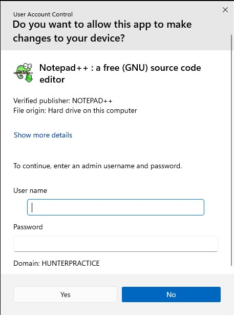
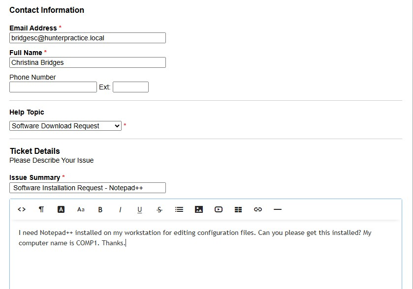
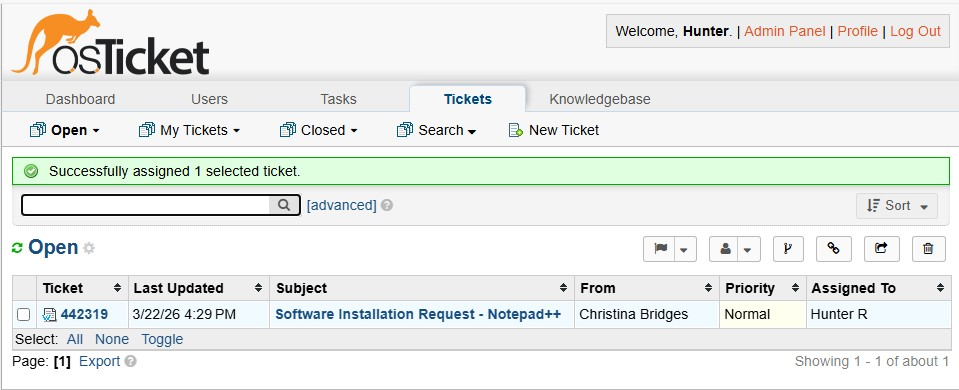
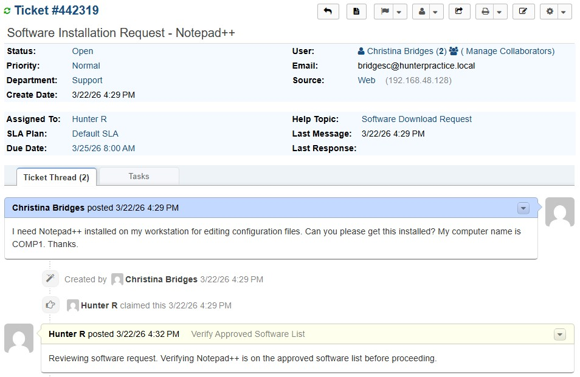
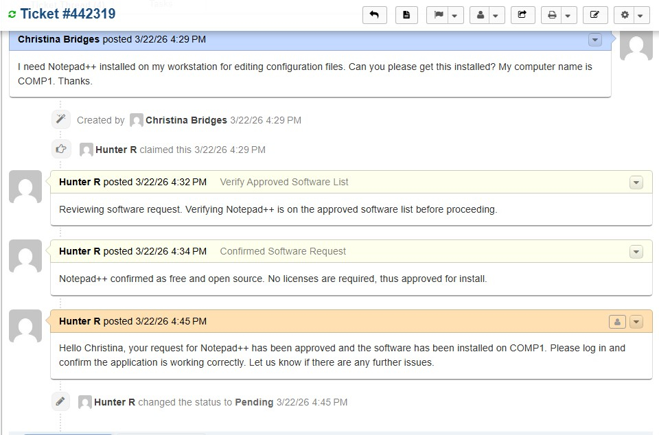
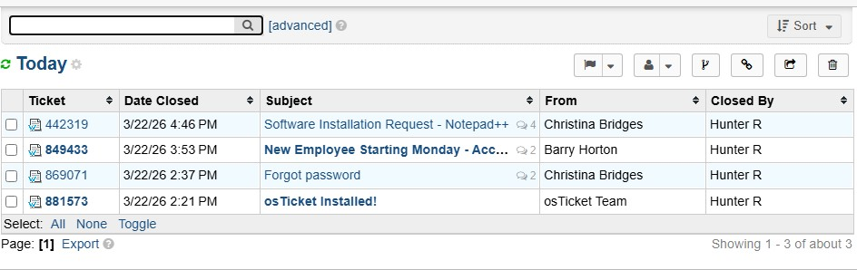
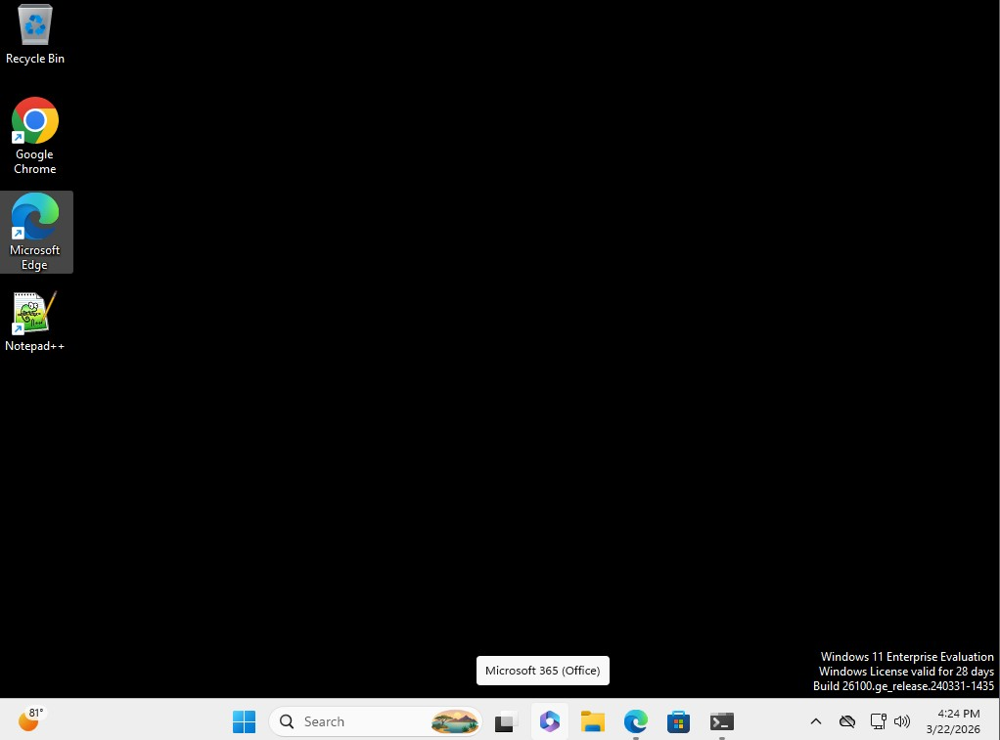

# Scenario 03 — Software Installation Request
 
## Overview
A user submits a request to have Notepad++ installed on their workstation. This scenario covers the full software request triage process including approval verification, UAC elevation, and installation confirmation.
 
---
 
## Environment
- **Ticketing System:** osTicket (self-hosted on WEB01)
- **Domain:** hunterpractice.local
- **Domain Controller:** WIN-AJ3IQ5KJNUB (Windows Server 2022)
- **Client Machine:** COMP1 (domain-joined Windows VM)
- **Requesting User:** C. Bridges (BridgesC)
- **Software Requested:** Notepad++ (free, open source text editor)
 
---
 
## Problem
User requested Notepad++ be installed on COMP1 for editing configuration files. Standard domain users are restricted from installing software via GPO — a UAC prompt requires administrator credentials to proceed with any installation.
 
**GPO Restriction Applied:**
- Standard users cannot install software without admin elevation
- UAC prompt requires domain admin credentials
- Error displayed: UAC credential prompt on installation attempt
 
---
 
## Ticket Workflow
 
| Status | Action |
|---|---|
| **New** | User submitted software request via osTicket client portal |
| **Open** | Technician assigned ticket and began triage |
| **Pending** | Software installed, awaiting user confirmation |
| **Resolved** | User confirmed software working, ticket closed |
 
---
 
## Troubleshooting Steps
 
### Step 1 — Receive and Triage Ticket
- Ticket received from BridgesC via osTicket client portal
- Assigned ticket to self in SCP
- Posted **internal note:** *"Reviewing software request. Verifying Notepad++ is on the approved software list before proceeding."*
 
### Step 2 — Verify Software Approval
- Confirmed Notepad++ is free and open source (no license required)
- Confirmed legitimate business use case (configuration file editing)
- Posted **internal note:** *"Notepad++ confirmed as free open source software. No license required. Approved for installation."*
 
### Step 3 — Attempt Installation as Standard User
- Logged into COMP1 as BridgesC
- Downloaded Notepad++ installer
- Attempted to run installer — UAC prompt appeared requiring admin credentials
- Confirmed GPO software restriction is working as intended
 
### Step 4 — Install Software as Admin
- Entered domain admin credentials into UAC prompt
- Completed Notepad++ installation
- Verified Notepad++ appeared in Start Menu and Programs list
- Confirmed application launched successfully
 
### Step 5 — Document and Close Ticket
- Replied to ticket confirming installation was complete
- Set ticket to **Pending** awaiting user confirmation
- User confirmed Notepad++ is working correctly
- Set ticket to **Resolved**
 
---
 
## Resolution
Software request reviewed and approved. Notepad++ confirmed as free open source software with a legitimate business use case. Installation completed on COMP1 using admin credentials via UAC elevation. User confirmed application is functioning correctly.
 
---
 
## Screenshots
 
| File | Description |
|---|---|
|  | User tries downloading Notepad++ and is met with a prompt |
|  | Ticket created by user |
|  | Current ticket queue |
|  | Internal note updating team on software research |
|  | Internal note updating team on software confirmation |
|  | Software downloaded and awaiting user confirmation |
|  | Ticket closed |
|  | Notepad++ installed on desktop |
 
---
 
## Key Concepts Demonstrated
- Software request triage and approval process
- GPO software restriction policy enforcement
- UAC elevation and admin credential usage
- Internal ticket notes for documenting thought process
- Corporate software installation workflow
