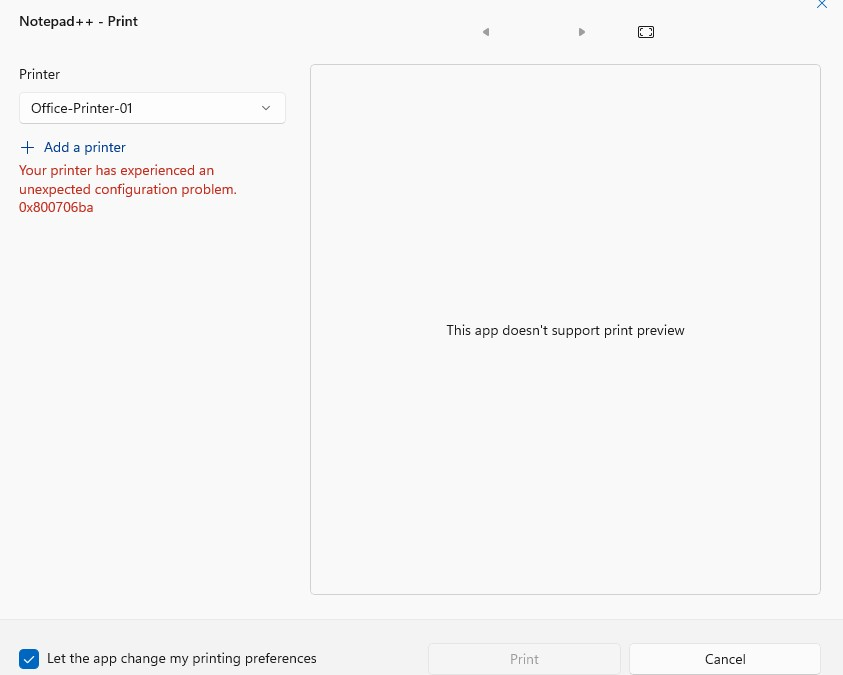
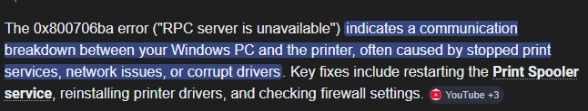
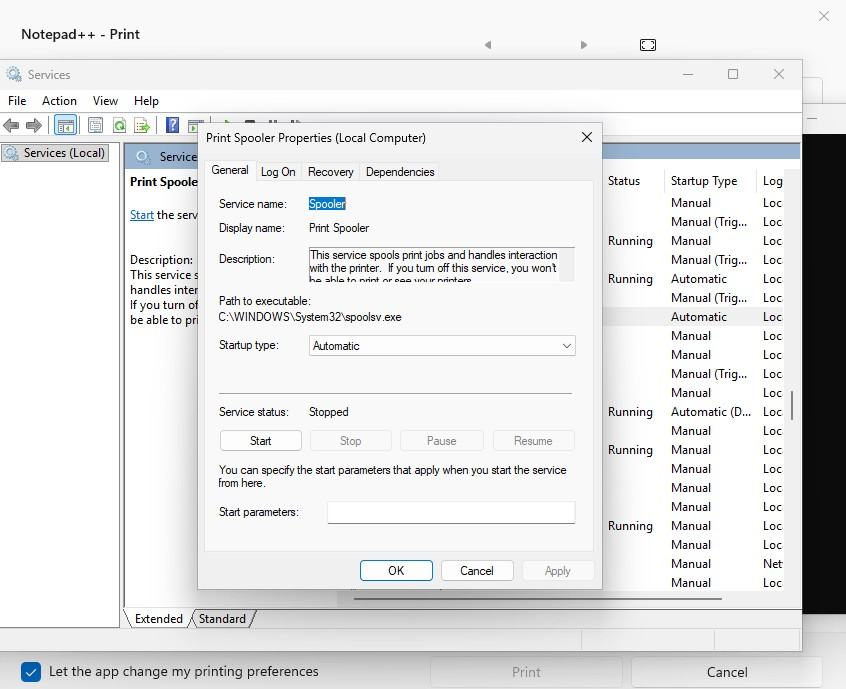
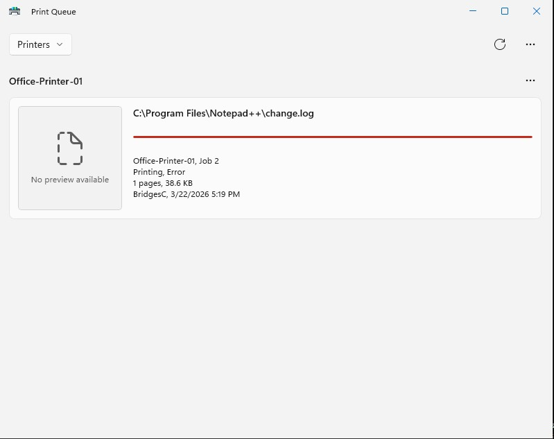
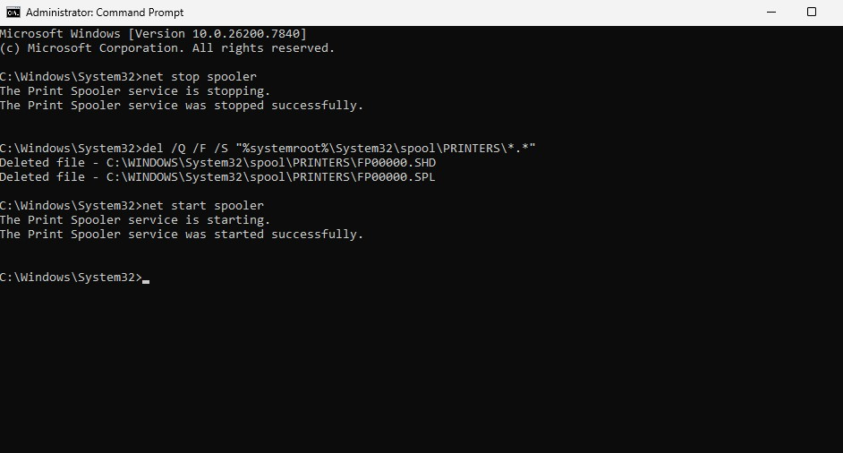
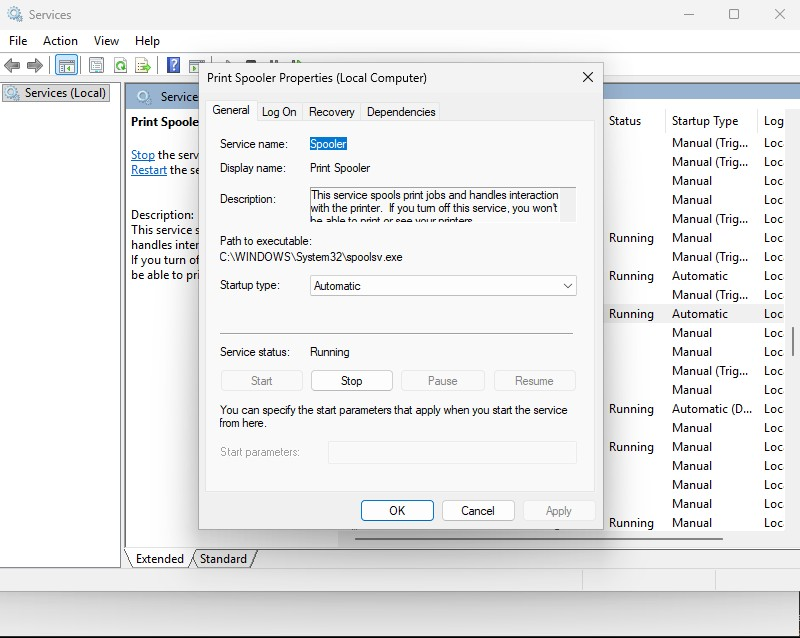
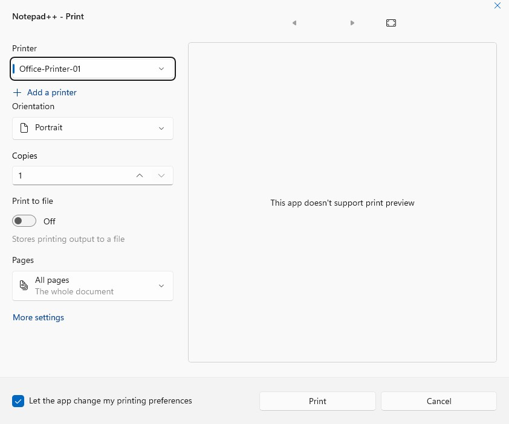

# Scenario 04 — Printer Not Working
 
## Overview
A user reports they are unable to print and receives an unexpected configuration error. This scenario covers print spooler troubleshooting, queue management, and printer recovery — one of the most frequently occurring help desk issues in any office environment.
 
---
 
## Environment
- **Ticketing System:** osTicket (self-hosted on OSTICKETMACHINE)
- **Domain:** hunterpractice.local
- **Client Machine:** COMP1 (domain-joined Windows VM)
- **Printer:** Office-Printer-01 (simulated local printer)
- **Error:** 0x800706ba — unexpected configuration error
 
---
 
## Problem
User was unable to print from COMP1. The printer displayed an unexpected configuration error `0x800706ba`. Investigation revealed the Windows Print Spooler service had crashed and stuck print jobs were present in the spool folder preventing recovery.
 
**Error Details:**
- Error code: `0x800706ba`
- Cause: Print Spooler service failure / stuck print jobs in spool queue
- Impact: All printing functionality unavailable on COMP1
 
---
 
## Ticket Workflow
 
| Status | Action |
|---|---|
| **New** | User submitted ticket via osTicket client portal |
| **Open** | Technician assigned ticket and began troubleshooting |
| **Pending** | Fix applied, awaiting user confirmation printing works |
| **Resolved** | User confirmed printing restored, ticket closed |
 
---
 
## Troubleshooting Steps
 
### Step 1 — Receive and Triage Ticket
- Ticket received via osTicket client portal
- Assigned ticket to self in SCP
- Noted error code 0x800706ba — consistent with Print Spooler failure
- Posted internal note documenting initial diagnosis
 
### Step 2 — Verify Print Spooler Status
- Opened `services.msc` on COMP1
- Located **Print Spooler** service
- Confirmed service was stopped/crashed
 
### Step 3 — Check Print Queue
- Confirmed stuck jobs were present in the queue preventing spooler restart
 
### Step 4 — Stop Spooler and Clear Queue
Stopped the Print Spooler service:
```cmd
net stop spooler
```
Cleared all stuck print jobs from the spool folder:
```cmd
del /Q /F /S "%systemroot%\System32\spool\PRINTERS\*.*"
```
- `/Q` — Quiet mode, no confirmation prompts
- `/F` — Force delete read-only files
- `/S` — Include all subdirectories
- Target: Windows print queue folder
 
### Step 5 — Restart Spooler and Verify
Restarted the Print Spooler service:
```cmd
net start spooler
```
- Confirmed service status returned to **Running** in services.msc
- Verified printer error was cleared in Printers & Scanners
- Confirmed printer status returned to **Ready**
 
### Step 6 — Document and Close Ticket
- Replied to ticket explaining the issue and resolution steps taken
- Set ticket to **Pending** awaiting user confirmation
- User confirmed printing is restored
- Set ticket to **Resolved**
 
---
 
## Resolution
Print Spooler service was found stopped due to a crash caused by stuck print jobs in the spool queue. Spooler was stopped, spool folder cleared of all stuck jobs, and service restarted. Printer returned to ready state and user confirmed printing functionality was restored.
 
---
 
## Screenshots
 
| File | Description |
|---|---|
|  | User sees printer error message |
|  | Quick search of error code shows it is a common spooler error |
|  | Printer spooler has stopped functioning |
|  | Queue shows one print has been requested |
|  | Command prompts troubleshooting spooler issue |
|  | Printer spooler resumed processes |
|  | Print request has been cleared |
|  | Printer spooler issue has been resolved |
 
---
 
## Key Concepts Demonstrated
- Windows Print Spooler service management
- Command line print queue troubleshooting
- services.msc navigation and service management
- Spool folder management and cleanup
- Real-world error code diagnosis (0x800706ba)
