# Scenario 05 — Cannot Access Network Share
 
## Overview
A user reports their mapped network drive is visible in File Explorer but inaccessible. This scenario covers a full structured network share troubleshooting methodology including connectivity checks, DNS verification, and share permission diagnosis.
 
---
 
## Environment
- **Ticketing System:** osTicket (self-hosted on OSTICKETMACHINE)
- **Domain:** hunterpractice.local
- **Domain Controller:** WIN-AJ3IQ5KJNUB (Windows Server 2022)
- **Client Machine:** COMP1 (domain-joined Windows VM)
- **Affected User:** C. Bridges (BridgesC)
 
---
 
## Problem
User reported that their Z: drive was visible in File Explorer but returned an access denied error when attempting to open it. Investigation revealed a Deny permission had been applied to HUNTERPRACTICE\Users on the CompanyFiles share, blocking all domain users from accessing it.
 
**Error Details:**
- Drive Z: visible but inaccessible in File Explorer
- UNC path \\WIN-AJ3IQ5KJNUB\CompanyFiles returning access denied
- Cause: Deny permission applied to HUNTERPRACTICE\Users on share permissions
 
---
 
## Ticket Workflow
 
| Status | Action |
|---|---|
| **New** | User submitted ticket via osTicket client portal |
| **Open** | Technician assigned ticket and began diagnostics |
| **Pending** | Fix applied, awaiting user confirmation Z: drive is accessible |
| **Resolved** | User confirmed Z: drive accessible, ticket closed |
 
---
 
## Troubleshooting Steps
 
### Step 1 — Receive and Triage Ticket
- Ticket received from BridgesC via osTicket client portal
- Assigned ticket to self in SCP
- Posted internal note: *"User reports Z: drive inaccessible. Beginning standard network share diagnostics will check connectivity, DNS resolution, and share availability."*
 
### Step 2 — Verify Network Configuration on COMP1
Ran IP configuration check to rule out client-side network issues:
```cmd
ipconfig /all
```
- Confirmed IP address, subnet mask, and DNS server were all correct
- Posted internal note: *"Ran ipconfig /all on COMP1. IP address, subnet mask, and DNS server all appear correct. Network configuration is not the issue."*
 
### Step 3 — Test Connectivity to WIN-AJ3IQ5KJNUB
Pinged the domain controller by hostname to verify basic connectivity:
```cmd
ping WIN-AJ3IQ5KJNUB
```
- Ping successful — confirmed network connectivity between COMP1 and WIN-AJ3IQ5KJNUB
- Posted internal note: *"Pinged WIN-AJ3IQ5KJNUB successfully. Network connectivity between COMP1 and WIN-AJ3IQ5KJNUB is confirmed. Issue is not network related."*
 
### Step 4 — Test DNS Resolution
Pinged WIN-AJ3IQ5KJNUB by IP address to isolate DNS as a potential cause:
```cmd
ping 192.168.X.X
```
- Ping by IP successful — confirmed DNS resolution is functioning correctly
- Posted internal note: *"Pinged WIN-AJ3IQ5KJNUB by IP successfully. DNS resolution also confirmed working. Connectivity is not the cause."*
 
 
### Step 5 — Investigate Share Permissions on WIN-AJ3IQ5KJNUB
- Navigated to `C:\Shared\CompanyFiles` on WIN-AJ3IQ5KJNUB
- Right clicked → Properties → Sharing tab → Advanced Sharing → Permissions
- Found **Deny** permission applied to **HUNTERPRACTICE\Users**
- Posted internal note: *"Located root cause. Deny permission found applied to HUNTERPRACTICE\Users on CompanyFiles share. Removing Deny permission now."*
 
### Step 6 — Restore Correct Permissions
- Removed the Deny permission from HUNTERPRACTICE\Users
- Verified correct Read/Write permissions were in place
- Ran gpupdate on COMP1 to refresh mapped drive:
```cmd
gpupdate /force
```
 
### Step 7 — Verify Fix on COMP1
- Logged into COMP1 as BridgesC
- Confirmed Z: drive was accessible in File Explorer
- Confirmed UNC path \\WIN-AJ3IQ5KJNUB\CompanyFiles opened successfully
 
### Step 8 — Document and Close Ticket
- Replied to ticket explaining the issue and resolution
- Set ticket to **Pending** awaiting user confirmation
- User confirmed Z: drive is accessible
- Set ticket to **Resolved**
 
---
 
## Resolution
Network connectivity and DNS resolution were confirmed functioning correctly on COMP1. Root cause identified as a Deny permission applied to HUNTERPRACTICE\Users on the CompanyFiles share on WIN-AJ3IQ5KJNUB. Deny permission was removed and correct permissions were restored. User confirmed Z: drive is accessible and all files can be reached.
 
---
 
## Screenshots
 
| File | Description |
|---|---|
| 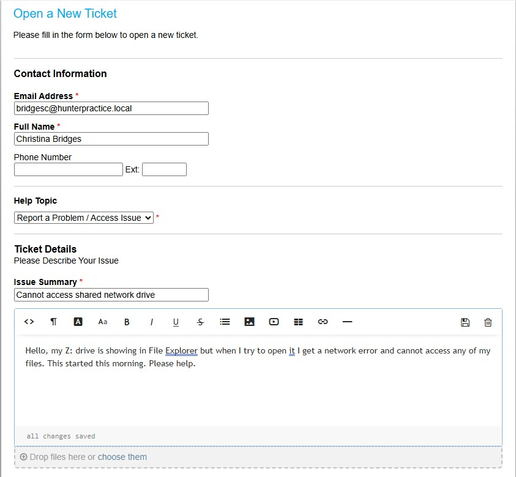 | User submitting ticket via osTicket client portal |
| 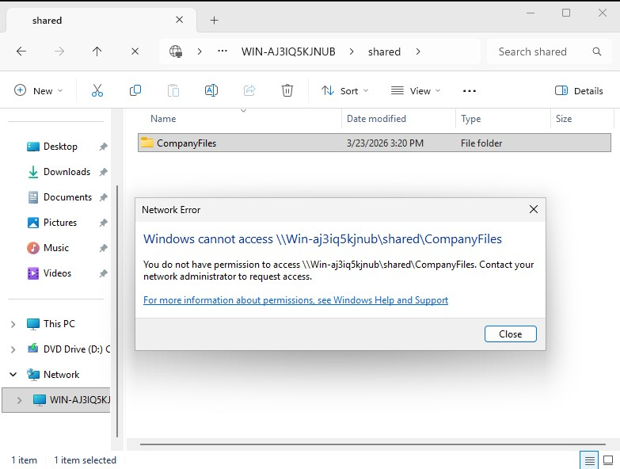 | User is unable to access shared drive from workstation |
| 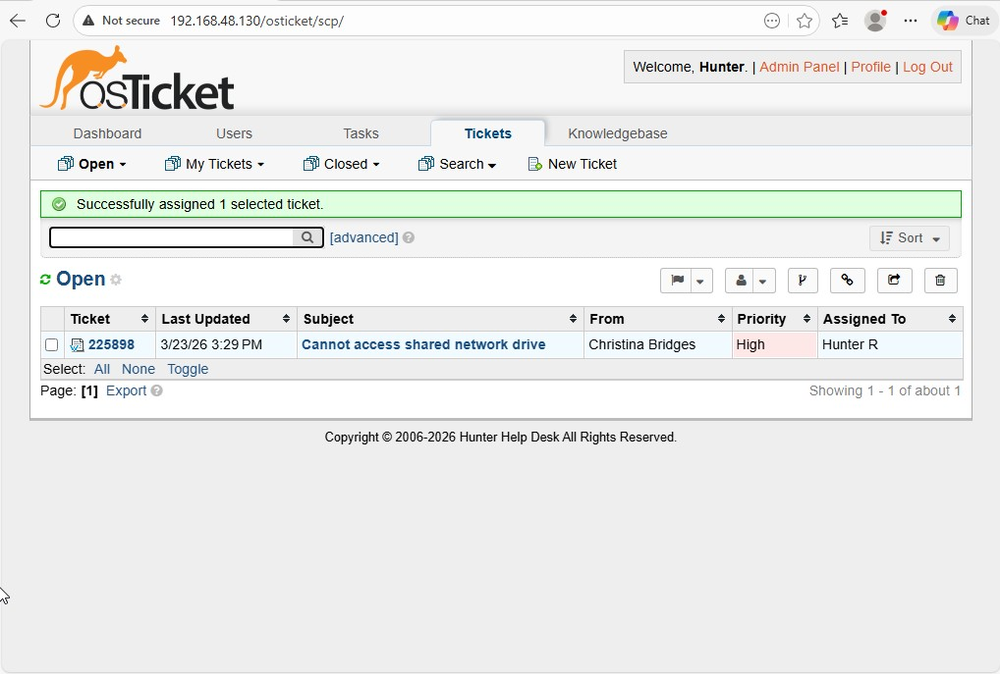 | Ticket shows up in queue and is assigned to agent Hunter R |
| 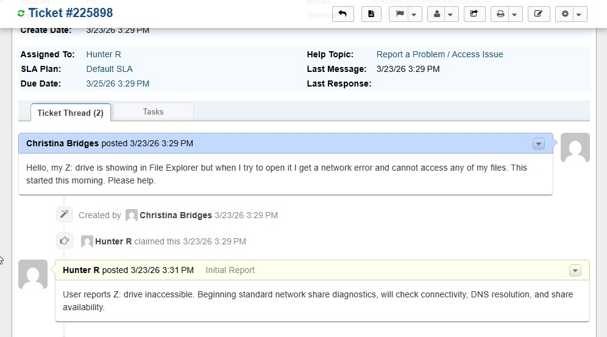 | Agent responds to ticket with initial internal note outlining the steps needed to address the issue |
| 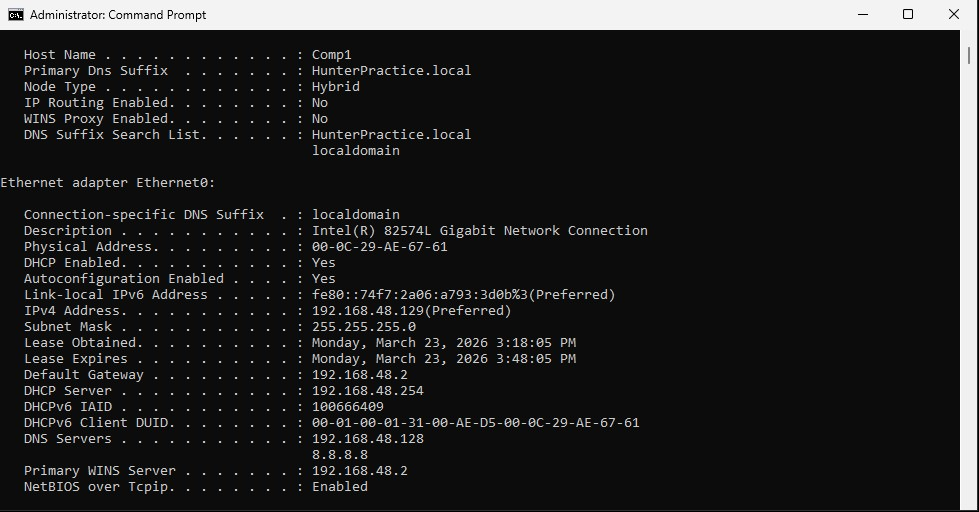 | Agent checks the IP connections from users workstation, all looks good |
| 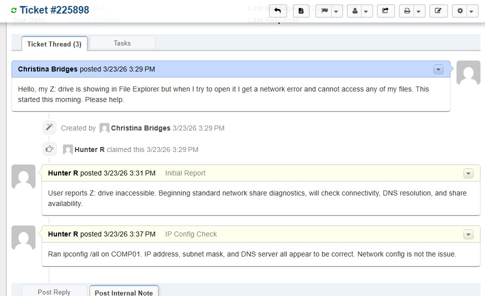 | Agent sends an internal note, showing that the issue wasn't caused by network config or connectivity error |
| 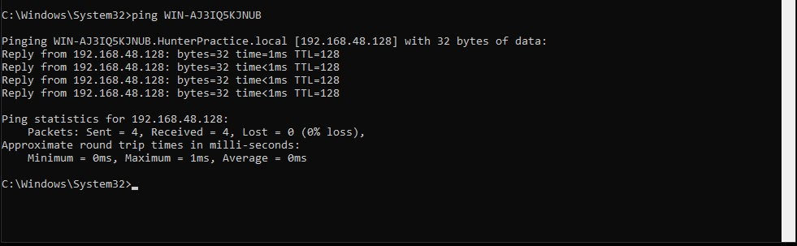 | Agent pings the domain controller by hostname, establishing there is a solid connection |
| 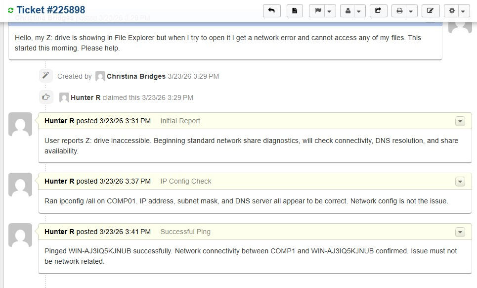 | Agent sends an internal note, further proving the issue wasn't caused by a network connectivity error |
| 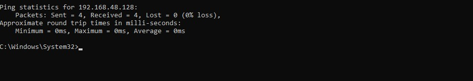 | Agent pings the domain controller by IP |
| 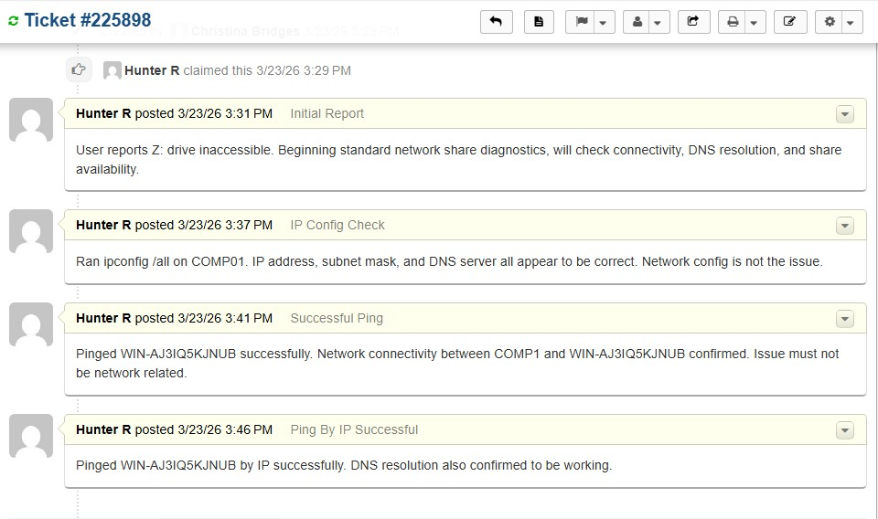 | Agent sends an internal note confirming DNS resolution is functioning correctly, narrowing the problem down to share permissions |
| 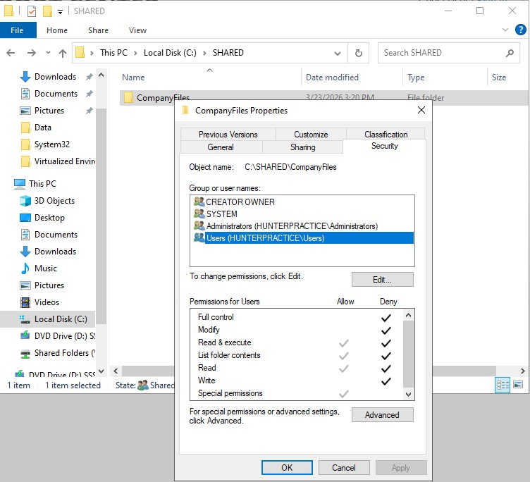 | Incorrect share permissions are found to be the root cause of the issue |
| 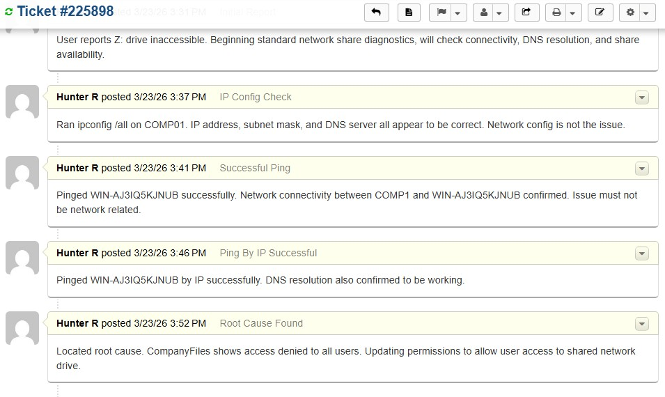 | Agent sends an internal note updating the team on the root cause of the issue |
| 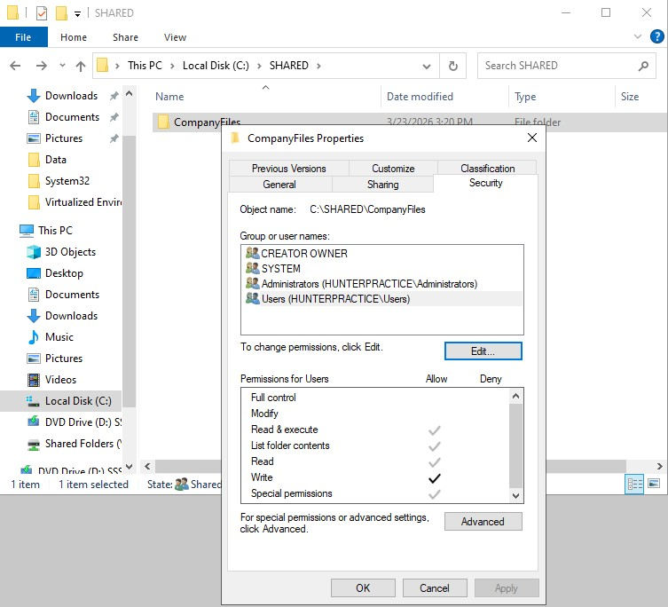 | Agent updates the permissions of the shared file |
| 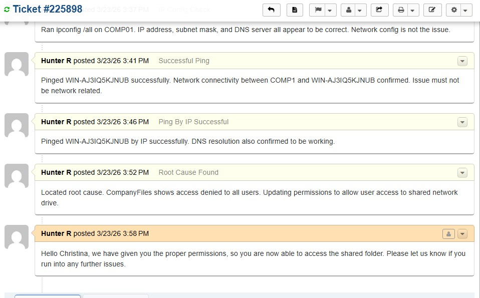 | Agent updates the user that the correct permissions have been restored |
| 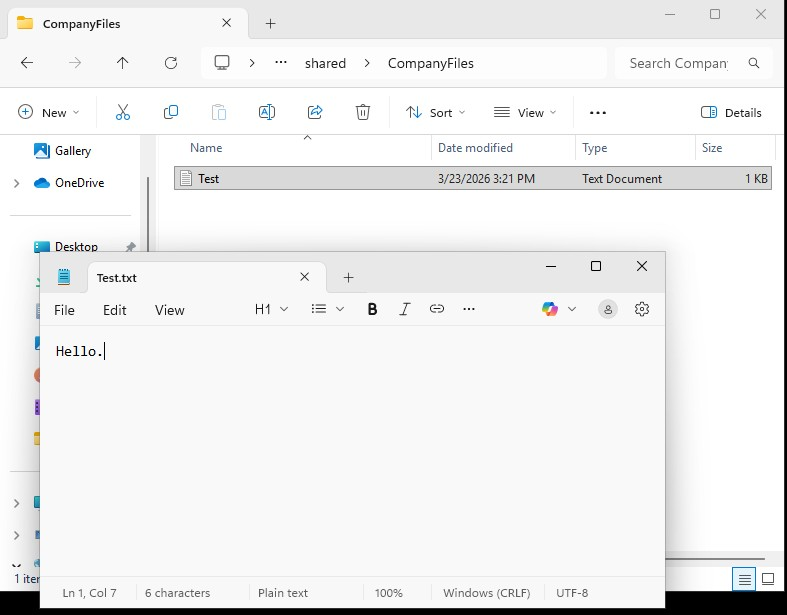 | User is able to now access the shared folder |
| 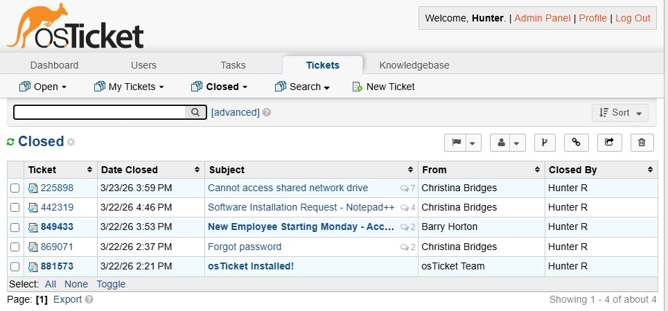 | Ticket has been resolved |

---
 
## Key Concepts Demonstrated
- Structured network share troubleshooting methodology
- ipconfig and ping diagnostic commands
- Windows share permission management
- Deny permission behavior in Windows ACLs
- GPO mapped drive configuration via Drive Maps preference
- Internal ticket notes documenting step by step diagnostic process
