# Scenario 06 — Slow Computer
 
## Overview
A user reports their computer has been running slow all morning affecting their ability to work. This scenario covers a structured performance diagnostic methodology including Task Manager analysis, disk usage checks, startup program review, and Windows update history investigation.
 
---
 
## Environment
- **Ticketing System:** osTicket (self-hosted on OSTICKETMACHINE)
- **Domain:** hunterpractice.local
- **Domain Controller:** WIN-AJ3IQ5KJNUB (Windows Server 2022)
- **Client Machine:** COMP1 (domain-joined Windows VM)
- **Affected User:** Christina Bridges (BridgesC)
 
---
 
## Problem
User reported COMP1 had been running slow all morning with applications taking a long time to open. A diagnostic check was performed to identify the root cause before taking any action.
 
---
 
## Ticket Workflow
 
| Status | Action |
|---|---|
| **New** | User submitted ticket via osTicket client portal |
| **Open** | Technician assigned ticket and began performance diagnostic |
| **Pending** | Fix applied, awaiting user confirmation performance has improved |
| **Resolved** | User confirmed performance restored, ticket closed |
 
---
 
## Troubleshooting Steps
 
### Step 1 — Receive and Triage Ticket
- Ticket received from BridgesC via osTicket client portal
- Assigned ticket to agent Hunter R in SCP
 
### Step 2 — Check Task Manager
Opened Task Manager on COMP1:
```cmd
taskmgr
```
- Reviewed **Performance tab**: checked CPU, Memory, and Disk usage percentages
- Reviewed **Processes tab**: sorted by CPU and Memory to identify any high usage processes
- Posted internal note documenting findings from Task Manager
 
### Step 3 — Check Disk Space
Ran disk space check via PowerShell:
```powershell
Get-Volume
```
- Reviewed free space vs total space on C: drive
- Low disk space confirmed or ruled out as a cause
- Posted internal note documenting disk space findings
 
### Step 4 — Review Startup Programs
Opened Task Manager → **Startup tab** to review programs launching on boot:
- Identified any high impact startup programs
- Disabled unnecessary startup items to reduce boot load
- Posted internal note documenting which startup items were found and disabled
 
### Step 5 — Check Recent Windows Updates
Reviewed recently installed updates via PowerShell:
```powershell
Get-HotFix | Sort-Object InstalledOn -Descending
```
- Checked if any updates installed recently coincided with when slowness began
- Posted internal note documenting update history findings
 
### Step 6 — Apply Fix and Restart
- Disabled unnecessary startup programs
- Performed restart to clear background update processes
 
### Step 7 — Document and Close Ticket
- Replied to ticket summarizing all diagnostic steps and actions taken
- Set ticket to **Pending** awaiting user confirmation
- User confirmed performance has improved
- Set ticket to **Resolved**
 
---
 
## Resolution
Full performance diagnostic performed on COMP1 covering CPU, memory, disk usage, startup programs, and recent Windows update history. Unnecessary startup programs were identified and disabled. Machine was restarted to clear background processes. User confirmed performance improvement after restart.
 
---
 
## Screenshots
 
| File | Description |
|---|---|
| 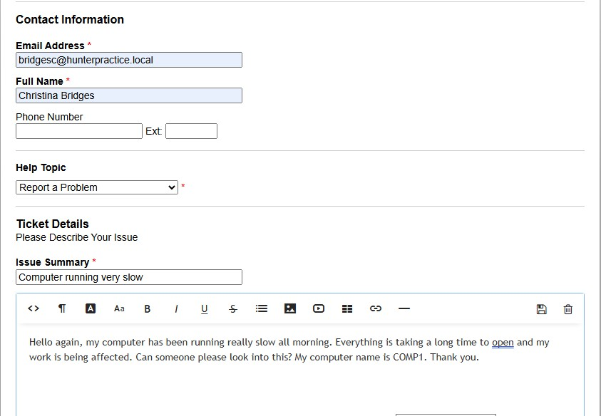 | User submitting slow computer ticket via client portal |
| 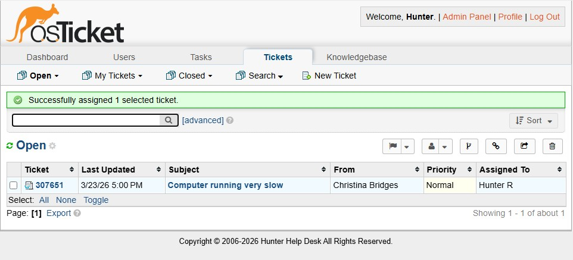 | Ticket assigned to agent Hunter R |
| 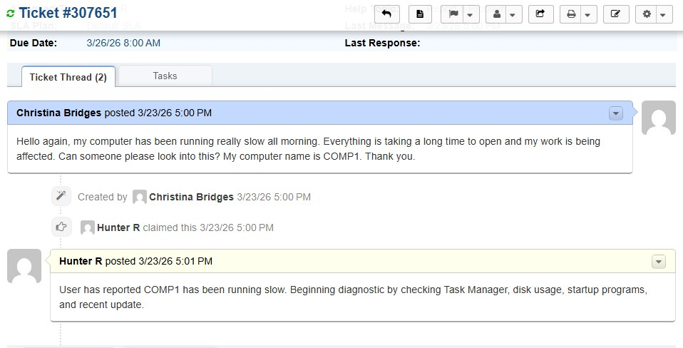 | Internal note outlining diagnostic plan |
| 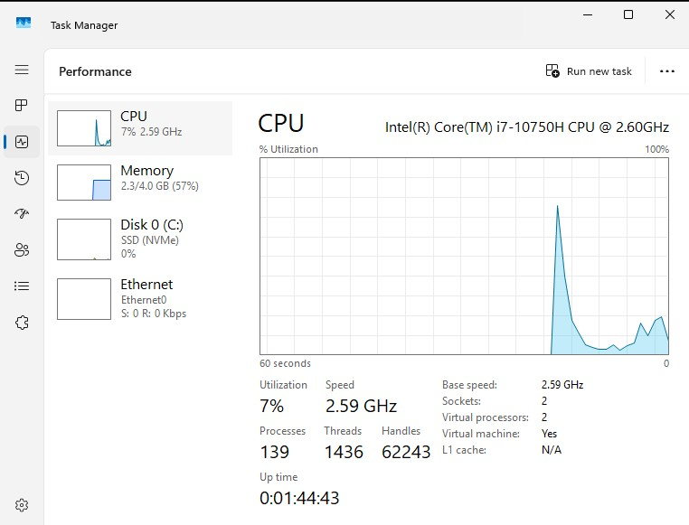 | Task Manager performance tab showing CPU, memory, and disk usage |
| 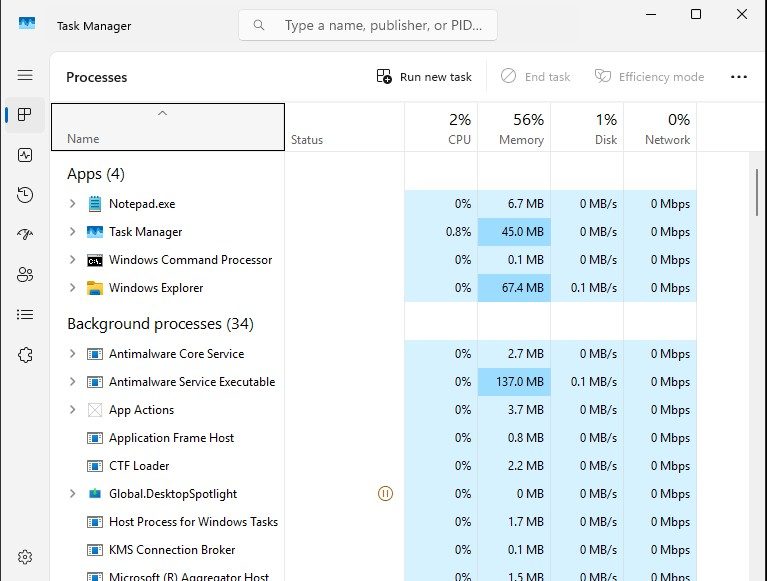 | Task Manager processes tab sorted by CPU usage |
| 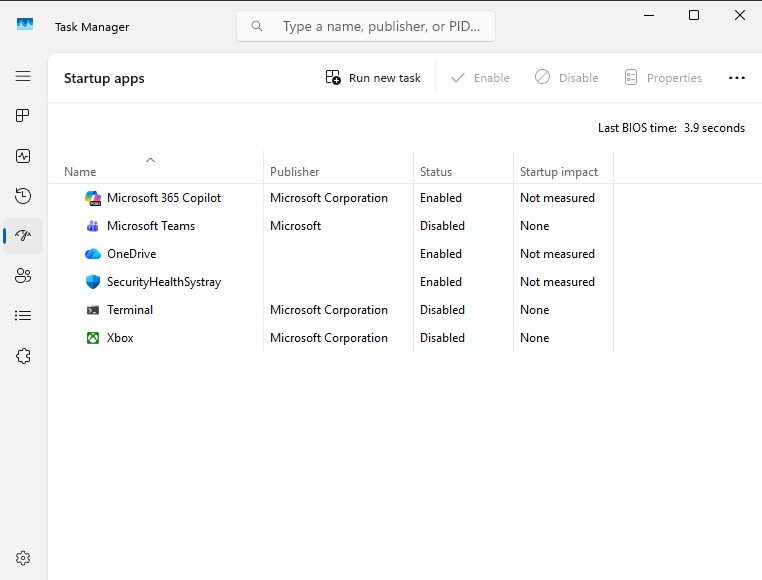 | Task Manager startup tab showing apps that are enabled on startup |
| 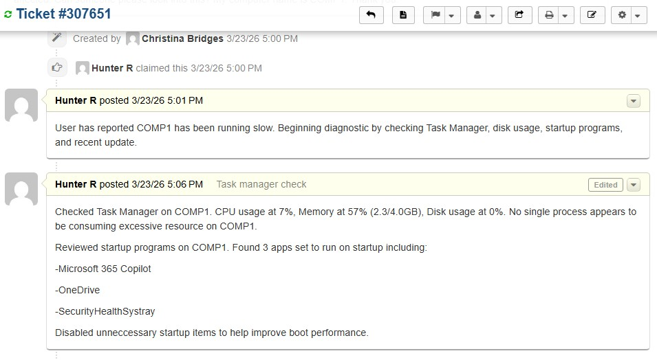 | Agent left internal note showcasing findings from task manager |
| 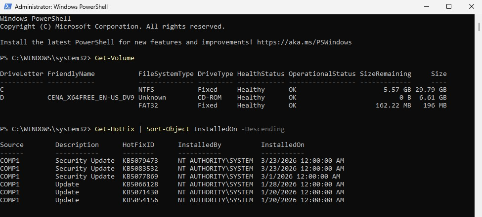 | Uses PowerShell commands to list recent Windows updates |
| 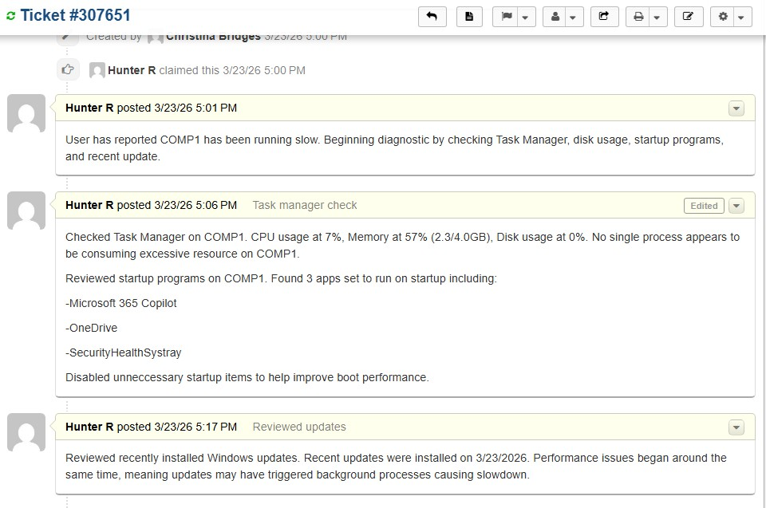 | Internal note documenting recent Windows updates on COMP1 and agent's attempt to restart the workstation |
| 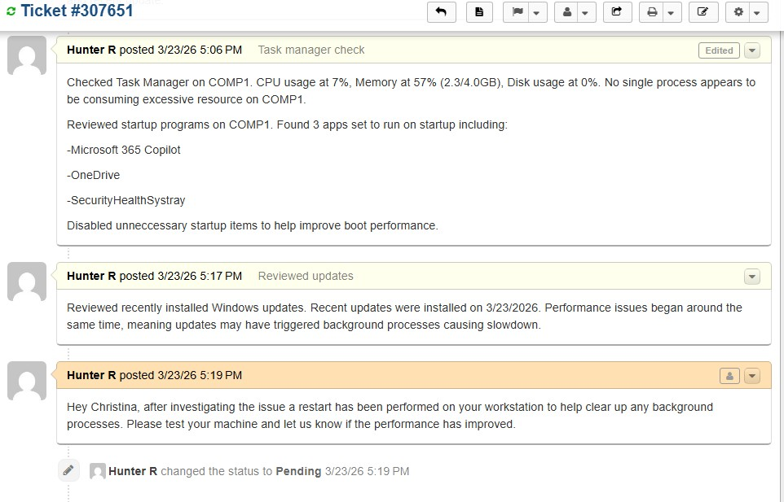 | Ticket pending update from user |
| 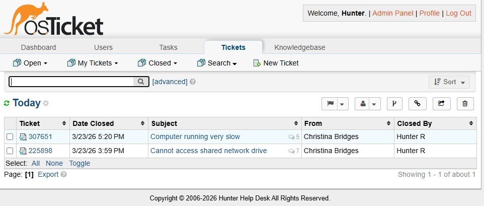 | Ticket has been resolved |
 
---
 
## Key Concepts Demonstrated
- Structured performance troubleshooting methodology
- Task Manager navigation and analysis
- Disk space diagnostics using PowerShell
- Startup program management
- Windows update history review
- Logical elimination approach to diagnosing performance issues
- PowerShell as modern replacement for deprecated wmic commands
